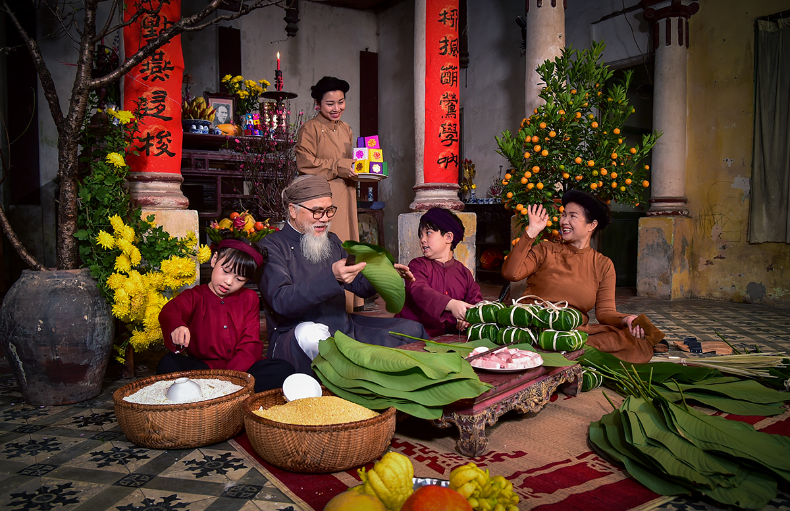

<html lang="vi">
<head>
    <meta charset="UTF-8">
    <meta name="viewport" content="width=device-width, initial-scale=1.0">
    <title>Chào Mừng Tết Nguyên Đán</title>
    <link href="https://fonts.googleapis.com/css2?family=Dancing+Script:wght@700&display=swap" rel="stylesheet">
    
</head>
<body>

    <!-- Thanh tiêu đề chạy ngang -->
    

        
✨ Chào Mừng Tết Nguyên Đán 2025 - Chúc Mừng Năm Mới 🎉

    

    <!-- Nội dung trang web -->
    

        <!-- Đoạn văn mặc định -->
        
Chúc bạn và gia đình một năm mới tràn đầy hạnh phúc và thành công! 🌟

        <!-- Đoạn văn P1 -->
        

            
            <strong>Hoa Đào - Biểu Tượng Của Mùa Xuân:</strong>  
            Tết Nguyên Đán là thời điểm hoa đào khoe sắc, mang lại may mắn và niềm vui cho mọi nhà.
        

        <!-- Đoạn văn P2 -->
        

            
            <strong>Tục Lệ Lì Xì - Chúc May Mắn Đầu Năm:</strong>  
            Những phong bao đỏ tượng trưng cho lời chúc phúc, tài lộc và bình an trong năm mới.
        

        <!-- Đoạn văn P3 -->
        

            
            <strong>Bánh Chưng - Hương Vị Của Tết:</strong>  
            Món bánh chưng truyền thống, biểu tượng của sự đoàn viên và văn hóa Việt Nam.
      

        
🎶 Nghe nhạc Tết: <strong>Xuân Đã Về</strong>

        <audio autoplay loop controls>
            <source src="y2mate.com - Ngày Xuân Long Phụng Xum Vầy Ngô Kiến Huy Khổng Tú Quỳnh Nhiều Ca Si 2013.mp3" type="audio/mpeg">
            Trình duyệt của bạn không hỗ trợ thẻ audio.
        </audio>
    

</body>
</html>
