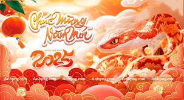

<html lang="vi">
<head>
    <meta charset="UTF-8">
    <meta name="viewport" content="width=device-width, initial-scale=1.0">
    <title>Xuân Ất Tỵ</title>
    
</head>
<body>
    <!-- Dòng chữ chạy -->
    
XUÂN ẤT TỴ-2025!

    <h1>Chào mừng đến với trang web Tết cổ truyền</h1>

    <!-- Hình ảnh ngày Tết -->
    

    <!-- Nội dung -->
    
Đây là nội dung giới thiệu về ngày Tết cổ truyền của Việt Nam. Tết là dịp để mọi người sum họp, quây quần bên nhau.

    
P1: Tết Nguyên Đán không chỉ là dịp lễ truyền thống mà còn là thời gian để tri ân tổ tiên và đón chào năm mới.

    
P2: Tục lệ lì xì đầu năm mang ý nghĩa chúc may mắn và tài lộc cho cả năm.

    
P3: Mâm cỗ Tết Việt bao gồm bánh chưng, dưa hành, thịt kho tàu, và nhiều món ăn đặc trưng khác.

    
Các hoạt động vui chơi trong dịp Tết như múa lân, bắn pháo hoa, và đi lễ chùa là những nét đẹp văn hóa truyền thống.

</body>
</html>
