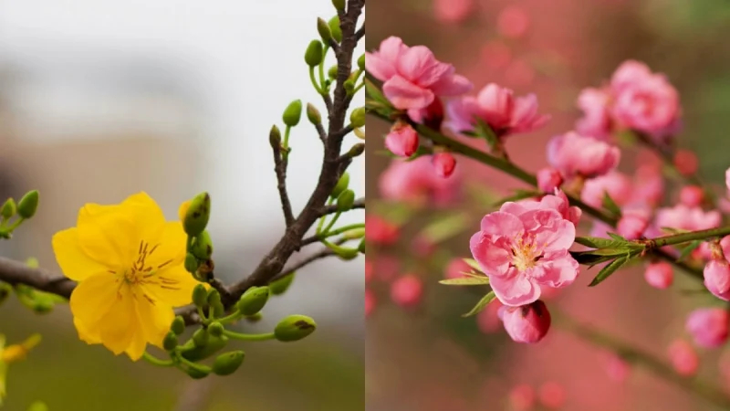

<html lang="vi">
<head>
    <meta charset="UTF-8">
    <meta name="viewport" content="width=device-width, initial-scale=1.0">
    <title>Chào Mừng Tết Nguyên Đán</title>
    <link href="https://fonts.googleapis.com/css2?family=Dancing+Script:wght@700&display=swap" rel="stylesheet">
    
</head>
<body>

    <!-- Thanh tiêu đề chạy ngang -->
    

        
✨ Chào Mừng Tết Nguyên Đán 2025 - Chúc Mừng Năm Mới 🎉

    

    <!-- Nội dung trang web -->
    

        <!-- Đoạn văn mặc định -->
        
Chúc bạn và gia đình một năm mới tràn đầy hạnh phúc và thành công! 🌟

        <!-- Đoạn văn P1 -->
        

            
            <strong>Đào Mai - Biểu Tượng Của Mùa Xuân:</strong>  
            Không ngạt ngào hương thơm nhưng chẳng biết từ bao giờ hoa Đào, hoa Mai đã trở thành biểu tượng của mùa xuân, mang đến niềm tin yêu cuộc sống và hy vọng may mắn, an lành đến mỗi gia đình Việt trong những ngày Tết đến xuân về...
        

        <!-- Đoạn văn P2 -->
        

            
            <strong>Mừng Tuổi Đầu Năm- Chúc May Mắn Đầu Năm:</strong> 
            Lì xì đầu năm mới là một trong những phong tục đẹp của hầu hết các quốc gia phương Đông, bao gồm cả Việt Nam, thường diễn ra trong ngày mồng 1 tháng Giêng hàng năm (có thể kéo dài đến mùng 9, mùng 10 tùy nơi). Qua đó, người nhận thể hiện mong muốn cầu chúc những điều may mắn và tốt đẹp nhất đến người nhận phong bao. Những phong bao đỏ tượng trưng cho lời chúc phúc, tài lộc và bình an trong năm mới.
        

        <!-- Đoạn văn P3 -->
        

            
            <strong>Bánh Chưng - Hương Vị Của Tết:</strong>  
            Món bánh chưng truyền thống, biểu tượng của sự đoàn viên và văn hóa Việt Nam.
      

        <audio autoplay loop controls>
            <source src="y2mate.com - Ngày Xuân Long Phụng Xum Vầy Ngô Kiến Huy Khổng Tú Quỳnh Nhiều Ca Si 2013.mp3" type="audio/mpeg">

  
    

